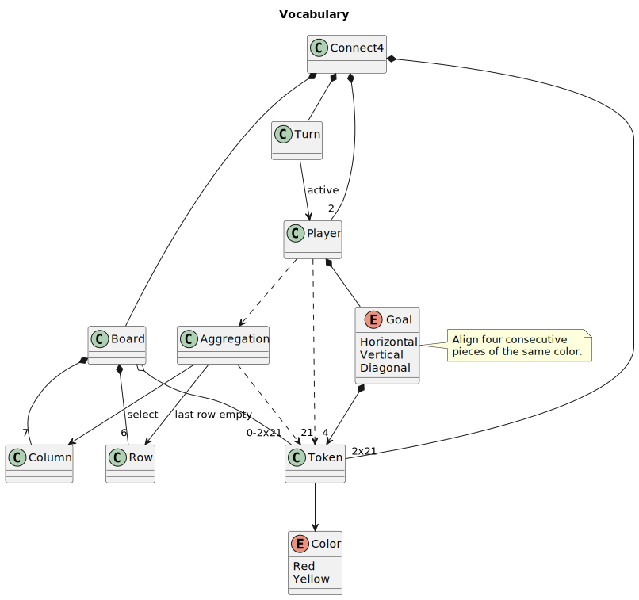

# Connect4

## Descripción del juego

**Connect4** o **Cuatro en línea** es un juego para dos jugadores. Cada jugador posee 21 fichas idénticas de un color diferente. Se juega en un tablero vertical que consiste de 7 columnas y 6 cuadros en cada una. Una jugada se puede definir como situar una ficha dentro de un cuadro del tablero, dentro de turnos. Cada jugador debe conectar 4 fichas de diferentes formas, ya sea horizontal, vertical, o diagonal. El primero que logre este resultado gana la partida, si las 42 fichas han sido utilizadas y ningún jugador ha logrado su meta, se considera un empate.

## Vocabulario

## Instrucciones

## Diagrama de estados

## Estado inicial

## Estado final